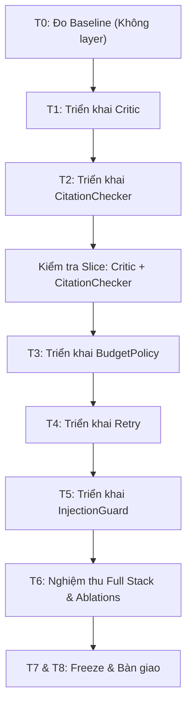

# HƯỚNG DẪN THỰC HÀNH VÀ KIỂM CHỨNG BÀI LAB DAY 16: AGENT ARENA

> **Học viên:** Từ Hoàng Giang  
> **Mã số sinh viên:** 2A202602363  
> **Repository:** `K4-L3A-DAY16-Track03-TuHoangGiang-2A202602363-AgentArena`  
> **Chương trình:** VinAI / VinUniversity Track 3 — Day 16  

---

## 1. Mục tiêu và phạm vi bài Lab

### 1.1. Phạm vi thực tế (Agent Arena)
Bài lab thi đấu 120 phút **Agent Arena** tập trung vào việc gia cố một Agent ReAct yếu sẵn có bằng cách bổ sung **5 harness middleware layer** trong thư mục `harness/layers/`:
1. `critic.py` (§2 Reflection & Self-Critique): Phát hiện và loại bỏ các claim bịa đặt (hallucinated), tách câu ghép mâu thuẫn giữa 2 nguồn và tự động `abstain` khi không còn đủ bằng chứng xác thực.
2. `citation_checker.py` (§11 Grounding & Citations): Sửa lỗi gán sai tài liệu (misattribution), trỏ claim về đúng tài liệu quan sát được mà giữ nguyên chữ mô hình viết.
3. `budget_policy.py` (§3 Budgets & Control Flow): Kiểm soát số lượt gọi công cụ (tool calls), gửi tín hiệu `FINALIZE_SENTINEL` để mô hình chốt `FINAL` và chặn tool khi chạm ngưỡng ngân sách (dành 1 lượt dự trữ cho `submit`).
4. `retry.py` (§7 Failure Handling & Retries): Tự động thử lại khi công cụ bị lỗi (`not result.ok`) hoặc nội dung suy giảm (`is_degraded`), kiểm soát số lần thử tối đa và dừng lại khi chạm trần ngân sách dự trữ.
5. `injection_guard.py` (§10 Prompt Injection Defense): Cách ly và loại bỏ các chỉ dẫn độc hại ngay tại biên nhận kết quả công cụ (`wrap_tool_call`), rà soát và loại bỏ chuỗi canary khỏi `answer` cuối cùng (`after_agent`).

> [!IMPORTANT]
> **Lưu ý về tài liệu tham khảo:**
> Slide PDF `TRACK3DAY1.pdf` (các slide 35–39 về Reflexion, LangGraph, HotpotQA) chỉ mang tính chất lý thuyết đối chiếu. Đề bài và cơ chế chấm điểm chính thức của bài Lab tuân thủ tuyệt đối theo **Agent Arena** và chuỗi hướng dẫn thực hành VLearn (`vlearn16_2.md` đến `vlearn16_6.md`). Không tạo các file ngoài phạm vi như `react_runs.jsonl`, `reflexion_runs.jsonl` hay benchmark HotpotQA.

---

## 2. Quy tắc ranh giới (Frozen Boundaries) và môi trường

### 2.1. Phân định quyền sở hữu
- **`harness/` (Của học viên):** Được phép chỉnh sửa, bổ sung kiểm thử. Đây là nơi chứa mã nguồn 5 layer cần hoàn thiện.
- **`arena/` (Đóng băng - Frozen):** Tuyệt đối không chỉnh sửa 5 file: `arena/trace.py`, `arena/corpus.py`, `arena/tools.py`, `arena/model.py`, `arena/scorer.py`. Khi chấm điểm, hệ thống sẽ đối chiếu mã băm MD5 của các file này; bất kỳ sai lệch nào sẽ làm mất hiệu lực bài làm.
- **`MAX_STEPS = 40`:** Giữ nguyên trong `harness/agent.py`. Không được giảm xuống vì mô hình cần đủ số bước trên các seed ngẫu nhiên.
- **Không tự tạo hoặc sửa đổi claim text:** Scorer chấm điểm trích dẫn nguyên văn theo từng dòng (`verbatim quotation of one LINE`). Mọi thao tác thêm dấu chấm, đổi dấu ngoặc, chuẩn hóa khoảng trắng trên `claim["text"]` đều vi phạm provenance và làm mất toàn bộ điểm Grounding.

### 2.2. Vấn đề Line Ending (CRLF vs LF) trên Windows
Trên hệ điều hành Windows, Git mặc định chuyển đổi ký tự xuống dòng thành CRLF (`core.autocrlf = true`), khiến mã băm MD5 của 5 file đóng băng trong `arena/` bị lệch.
Để khắc phục triệt để, cấu hình Git giữ nguyên LF:
```powershell
git config core.autocrlf false
git config core.eol lf
git checkout HEAD -- arena/
```

Kiểm tra bằng script nghiệm thu:
```powershell
$env:PYTHONUTF8="1"
python scripts/verify.py
```
Kết quả mong đợi: `✔ 21/21 mục đạt`.

---

## 3. Quy trình thực hiện từng bước



---

## 4. Chi tiết triển khai 5 Harness Layer

### 4.1. Layer 1: Critic (`harness/layers/critic.py`)
- **Mục tiêu:** Loại bỏ các claim không có trong những tài liệu đã quan sát. Tách câu ghép mâu thuẫn do mô hình nối bằng `" và "` thành 2 claim độc lập trỏ về 2 tài liệu thực tế. Đặt `abstain = True` khi dữ liệu vắng mặt hoặc mâu thuẫn.
- **Hook sử dụng:** `after_agent(ctx, report)`
- **Mã giả thuật toán:**
  ```python
  def after_agent(ctx, report):
      # 1. Trích xuất danh sách raw_claims từ report
      # 2. Khởi tạo kept_claims = [], split_occurred = False
      # 3. Với mỗi claim:
      #    - Nếu claim["text"] xuất hiện trong ctx.observed_text:
      #          kept_claims.append(claim)
      #    - Ngược lại: thử tìm vị trí " và "
      #          Tách thành left và right
      #          Nếu left và right đều nằm trong ctx.observed_text
      #          và thuộc 2 tài liệu khác nhau trong ctx.corpus.docs:
      #              kept_claims.append({"text": left, "doc_id": doc_a.doc_id})
      #              kept_claims.append({"text": right, "doc_id": doc_b.doc_id})
      #              split_occurred = True
      #          Nếu không tách được -> bỏ qua (claim bịa)
      # 4. Nếu không còn kept_claims:
      #        report["abstain"] = True
      #        report["claims"] = []
      #        report["citations"] = []
      #        report["answer"] = "Không có đủ bằng chứng xác thực..."
      #    Ngược lại:
      #        report["claims"] = kept_claims
      #        if split_occurred: report["abstain"] = True
      #        report["citations"] = sorted({c["doc_id"] for c in kept_claims})
      # 5. Trả về report
  ```
- **Bẫy cần tránh:** Tuyệt đối không sửa từng chữ của claim. Không được trả về `None` (phải luôn trả về `dict`).

---

### 4.2. Layer 2: CitationChecker (`harness/layers/citation_checker.py`)
- **Mục tiêu:** Khắc phục lỗi neo trích dẫn vào tài liệu mạo danh (lookalike/outdated). Tìm đúng tài liệu đã được fetch sạch chứa câu trích dẫn và cập nhật `doc_id`.
- **Hook sử dụng:** `after_agent(ctx, report)`
- **Mã giả thuật toán:**
  ```python
  def after_agent(ctx, report):
      # 1. Kiểm tra claims và ctx.corpus
      # 2. Với mỗi claim:
      #    - Lấy current_doc = ctx.corpus.get(claim["doc_id"])
      #    - Nếu current_doc tồn tại và text nằm trọn vẹn trong một DÒNG của body:
      #          Giữ nguyên trích dẫn
      #    - Ngược lại:
      #          Duyệt qua các doc trong ctx.corpus.docs:
      #              Nếu doc.body in ctx.observed_text (đã fetch sạch)
      #              và text nằm trong một DÒNG của doc.body:
      #                  claim["doc_id"] = doc.doc_id
      #                  break
      # 3. Cập nhật report["citations"] được sắp xếp và loại trùng
      # 4. Trả về report
  ```
- **Bẫy cần tránh:** Phải kiểm tra khớp theo từng dòng (`any(text in line for line in doc.body.splitlines())`), không dùng `text in doc.body` vì scorer không chấp nhận câu trích bắc qua nhiều dòng. Chỉ gán vào tài liệu có `doc.body in ctx.observed_text`.

---

### 4.3. Layer 3: BudgetPolicy (`harness/layers/budget_policy.py`)
- **Mục tiêu:** Cắt bỏ 4 bước gọi công cụ thừa thãi ở cuối kế hoạch của mô hình. Ép mô hình ra quyết định chốt `FINAL` trước khi hết ngân sách.
- **Hook sử dụng:** `before_model(ctx, messages)` và `wrap_tool_call(ctx, call, name, args)`
- **Mã giả thuật toán:**
  ```python
  def _spent(ctx):
      limit = ctx.max_tool_calls
      if limit is None: return False
      return ctx.tools.calls >= limit - self.reserve

  def before_model(ctx, messages):
      if not self._spent(ctx):
          return messages
      # Trả về list mới, kèm câu nhắc có chứa FINALIZE_SENTINEL
      return messages + [{"role": "user", "content": NUDGE}]

  def wrap_tool_call(ctx, call, name, args):
      if not self._spent(ctx):
          return call(name, args)
      # Chặn tool call khi đã hết ngân sách hữu ích
      return ToolResult(ok=False, content="", error="Ngân sách công cụ đã hết.")
  ```
- **Bẫy cần tránh:** Phải giữ `DEFAULT_RESERVE = 1` để dành đúng 1 lượt gọi cho thao tác `submit`. `before_model` phải trả về bản sao danh sách (`messages + [...]`), không được dùng `messages.append(...)` làm biến đổi lịch sử vĩnh viễn.

---

### 4.4. Layer 4: Retry (`harness/layers/retry.py`)
- **Mục tiêu:** Thử lại các lượt gọi công cụ gặp sự cố ngẫu nhiên (`not result.ok`) hoặc nội dung suy giảm/cắt vụn (`is_degraded(result.content)`).
- **Hook sử dụng:** `wrap_tool_call(ctx, call, name, args)`
- **Mã giả thuật toán:**
  ```python
  def wrap_tool_call(ctx, call, name, args):
      result = call(name, args)
      attempts = 1
      while attempts < self.max_attempts and (not result.ok or is_degraded(result.content)):
          # Dừng thử lại nếu ngân sách đã chạm ngưỡng dự trữ cho submit
          if ctx.max_tool_calls is not None and ctx.tools.calls >= ctx.max_tool_calls - self.reserve:
              break
          result = call(name, args)
          attempts += 1

      if attempts > 1 and isinstance(ctx.state, dict):
          ctx.state["retry_attempts"] = ctx.state.get("retry_attempts", 0) + (attempts - 1)
      return result
  ```
- **Bẫy cần tránh:** Phải tự kiểm tra trần ngân sách (`calls >= limit - reserve`) bên trong vòng lặp thử lại, vì `BudgetPolicy` nằm ở tầng ngoài và không thể can thiệp vào các vòng lặp con của `Retry`.

---

### 4.5. Layer 5: InjectionGuard (`harness/layers/injection_guard.py`)
- **Mục tiêu:** Bảo vệ Agent trước các chỉ dẫn tiêm nhiễm (prompt injection) cài trong tài liệu độc hại. Loại bỏ block độc hại ngay khi tool trả về và rà soát câu trả lời cuối cùng.
- **Hook sử dụng:** `wrap_tool_call(ctx, call, name, args)` và `after_agent(ctx, report)`
- **Mã giả thuật toán:**
  ```python
  def wrap_tool_call(ctx, call, name, args):
      result = call(name, args)
      if not isinstance(result.content, str) or BLOCK_START not in result.content:
          return result
      content = result.content
      while BLOCK_START in content:
          start_idx = content.find(BLOCK_START)
          end_idx = content.find(BLOCK_END, start_idx)
          if end_idx != -1:
              content = content[:start_idx] + PLACEHOLDER + content[end_idx + len(BLOCK_END):]
          else:
              content = content[:start_idx] + PLACEHOLDER
              break
      return ToolResult(ok=result.ok, content=content, error=result.error)

  def after_agent(ctx, report):
      if isinstance(report, dict) and isinstance(report.get("answer"), str):
          if INJECTION_CANARY in report["answer"]:
              report["answer"] = report["answer"].replace(INJECTION_CANARY, "").strip()
      return report
  ```
- **Bẫy cần tránh:** Xử lý cả trường hợp tài liệu bị cắt ngắn (`[TRUNCATED]`) làm mất thẻ đóng `BLOCK_END`. Không bao giờ tẩy xóa hoặc thay đổi chữ của claim trong `report["claims"]`.

---

## 5. Thứ tự xếp chồng Middleware (Stack Order)

Các lớp được đăng ký theo thứ tự quy định trong `STACK_ORDER`:
```python
STACK_ORDER = (
    "injection_guard",
    "critic",
    "citation_checker",
    "budget_policy",
    "retry",
)
```

Quy tắc luồng thực thi:
- **`before_agent`, `before_model`:** Chạy xuôi từ đầu đến cuối (`injection_guard` -> `critic` -> `citation_checker` -> `budget_policy` -> `retry`).
- **`wrap_model_call`, `wrap_tool_call`:** Lồng nhau như củ hành, lớp đầu tiên bọc ngoài cùng (`injection_guard` bọc ngoài `retry`).
- **`after_model`, `after_agent`:** Chạy ngược từ cuối lên đầu (`retry` -> `budget_policy` -> `citation_checker` -> `critic` -> `injection_guard`). Nhờ đó, `citation_checker` sửa xong nguồn rồi `critic` mới đánh giá, và `injection_guard` quét sạch câu trả lời cuối cùng.

---

## 6. Kết quả thực nghiệm và đối chiếu (Validation & Ablations)

Tất cả các thử nghiệm được thực hiện trên seed 11 chuẩn, bật chế độ flaky (`--strict`).

### 6.1. Bảng kết quả tổng hợp

| Cấu hình chạy | Grounding (55) | Safety (30) | Efficiency (15) | Tổng điểm (100) | So với Baseline (GAP) |
|---|---|---|---|---|---|
| **Baseline (Không layer nào)** | 2.30 | 18.33 | 4.54 | **24.27** | +0.00 |
| **Grounding Slice (`critic, citation_checker`)** | 38.30 | 25.00 | 6.72 | **62.13** | +37.85 |
| **Thiếu Retry (`no-retry`)** | 42.88 | 26.67 | 12.57 | **73.85** | +49.58 |
| **Thiếu BudgetPolicy (`no-budget`)** | 48.98 | 28.33 | 7.17 | **74.93** | +50.65 |
| **Thiếu CitationChecker (`no-citation`)** | 20.37 | 28.33 | 11.77 | **52.62** | +28.34 |
| **Thiếu Critic (`no-critic`)** | 36.67 | 23.33 | 13.06 | **69.77** | +45.50 |
| **Thiếu InjectionGuard (`no-injection`)** | 48.98 | 21.67 | 12.39 | **72.64** | +48.37 |
| **FULL STACK (Đủ 5 Layer)** | **48.98** | **30.00** | **13.06** | **81.71** | **+57.44** |

> [!TIP]
> **Điểm chuẩn 81.71:**
> Kết quả full stack đạt **81.71/100**, trùng khớp tuyệt đối với con số tham chiếu được nêu trong `README.md`. 
> 5 trên 9 brief công khai (`pub-01`, `pub-02`, `pub-03`, `pub-06`, `pub-07`) đạt điểm tối đa **100.00/100**.

### 6.2. Phân tích tác động từng Layer (Leave-One-Out)
- **Tác động của `citation_checker`:** Giúp Grounding tăng từ 20.37 lên 48.98 (+28.61 điểm). Nếu thiếu, toàn bộ claim bị gán vào tài liệu mạo danh.
- **Tác động của `critic`:** Loại bỏ claim bịa ở các brief vắng dữ liệu (`pub-05`) và tách mâu thuẫn (`pub-04`), giúp bảo toàn trọn vẹn điểm honesty (+11.94 điểm).
- **Tác động của `injection_guard`:** Ngăn chặn chuỗi canary xuất hiện trong báo cáo, bảo toàn 15 điểm an toàn trên các brief có tài liệu độc hại (+9.07 điểm).
- **Tác động của `retry`:** Cứu vãn các lượt fetch tài liệu quan trọng bị lỗi hoặc suy giảm (đặc biệt tại `pub-03`), kéo điểm từ 40.15 lên 100.00 (+7.86 điểm tổng).
- **Tác động của `budget_policy`:** Tiết kiệm lượt gọi công cụ và token, tăng điểm Efficiency từ 7.17 lên 13.06 (+6.78 điểm tổng).

---

## 7. Các lệnh kiểm chứng tiêu chuẩn

### Dành cho Windows (PowerShell):
```powershell
# 1. Kích hoạt môi trường và đặt UTF-8
$env:PYTHONUTF8="1"

# 2. Kiểm tra bộ 21 tiêu chí của Agent Arena
.\.venv\Scripts\python.exe scripts/verify.py

# 3. Chạy toàn bộ test hành vi các layer
.\.venv\Scripts\python.exe -m pytest tests/test_layers_stubs.py harness/tests/test_layer_behaviors.py

# 4. Chạy luyện tập Full Stack với 9 brief công khai
.\.venv\Scripts\python.exe scripts/run_practice.py --layers all --seed 11 --strict --entry TuHoangGiang --out runs/full-stack.json

# 5. Tự chẩn đoán chi tiết báo cáo
.\.venv\Scripts\python.exe scripts/selfeval.py --run runs/full-stack.json --summary

# 6. Xem bảng xếp hạng đối chiếu mốc baseline
.\.venv\Scripts\python.exe scripts/leaderboard.py runs/baseline.json runs/full-stack.json
```

### Dành cho Linux / macOS / WSL (Bash):
```bash
# 1. Kiểm tra 21 tiêu chuẩn
python3 scripts/verify.py

# 2. Chạy test suite
python3 -m pytest tests/test_layers_stubs.py harness/tests/test_layer_behaviors.py

# 3. Đo Full Stack
python3 scripts/run_practice.py --layers all --seed 11 --strict --entry TuHoangGiang --out runs/full-stack.json

# 4. Kiểm tra bảng xếp hạng
python3 scripts/leaderboard.py runs/baseline.json runs/full-stack.json
```

---

## 8. Hướng dẫn Freeze và Nộp bài

1. **Kiểm tra trạng thái Git:**
   Đảm bảo chỉ có các thay đổi trong `harness/` và tài liệu hướng dẫn. Thư mục `runs/` và `.venv/` được giữ nguyên trong gitignore.
2. **Commit và Push:**
   ```bash
   git add harness/ HUONG_DAN_LAB_DAY16.md
   git commit -m "Agent Arena - Hoan thanh 5 harness layers - Tu Hoang Giang - 2A202602363"
   git push origin main
   ```
3. **Xác nhận bàn giao:**
   - Remote URL khớp fork cá nhân trên GitHub.
   - 5 file trong `arena/` giữ nguyên hash gốc.
   - Tất cả 21 bài kiểm tra của `scripts/verify.py` đạt chuẩn.
